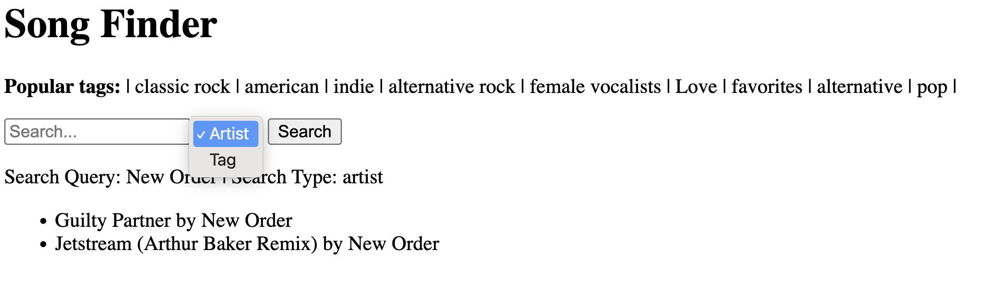

# Song Finder Web Application

This web application leverages the Million Song Dataset to provide an extensive search and data viewing interface for music metadata. Users can interact with a wide range of data, exploring by artist, tag, or through various other search functionalities.

## Dataset

The application utilizes a subset of the Million Song Dataset available as JSON files, each containing detailed metadata for a single song. This includes:
- Title
- Artist
- Tags (e.g., pop, alternative)
- Similar songs

The subset can be downloaded [here](http://millionsongdataset.com/sites/default/files/lastfm/lastfm_subset.zip).

## Features

Song Finder offers several search capabilities:

1. **Search by Artist**  
   Enter an artist's name (e.g., Phil Collins) to display all their songs, showing at least the title for each.

2. **Search by Tag**  
   Specify a tag (e.g., pop) to list all songs associated with it, showing the title and artist for each song.

3. **Most Popular Tags**  
   The application displays the ten most frequently used tags, including the tag and the number of songs associated with each.

4. **Artists with More Than <n> Songs**  
   Input a number `<n>` to find artists with at least `<n>` songs, listing each artist and their song titles.

5. **Tags with More Than <n> Songs**  
   Similar to the artist search, but displays tags applied to at least `<n>` songs, listing each song under the tag with its title and artist.

## User Interface

Here's how the front-end of the Song Finder looks:

## License

This project is licensed under the MIT License - see the [LICENSE.md](LICENSE.md) file for details.
